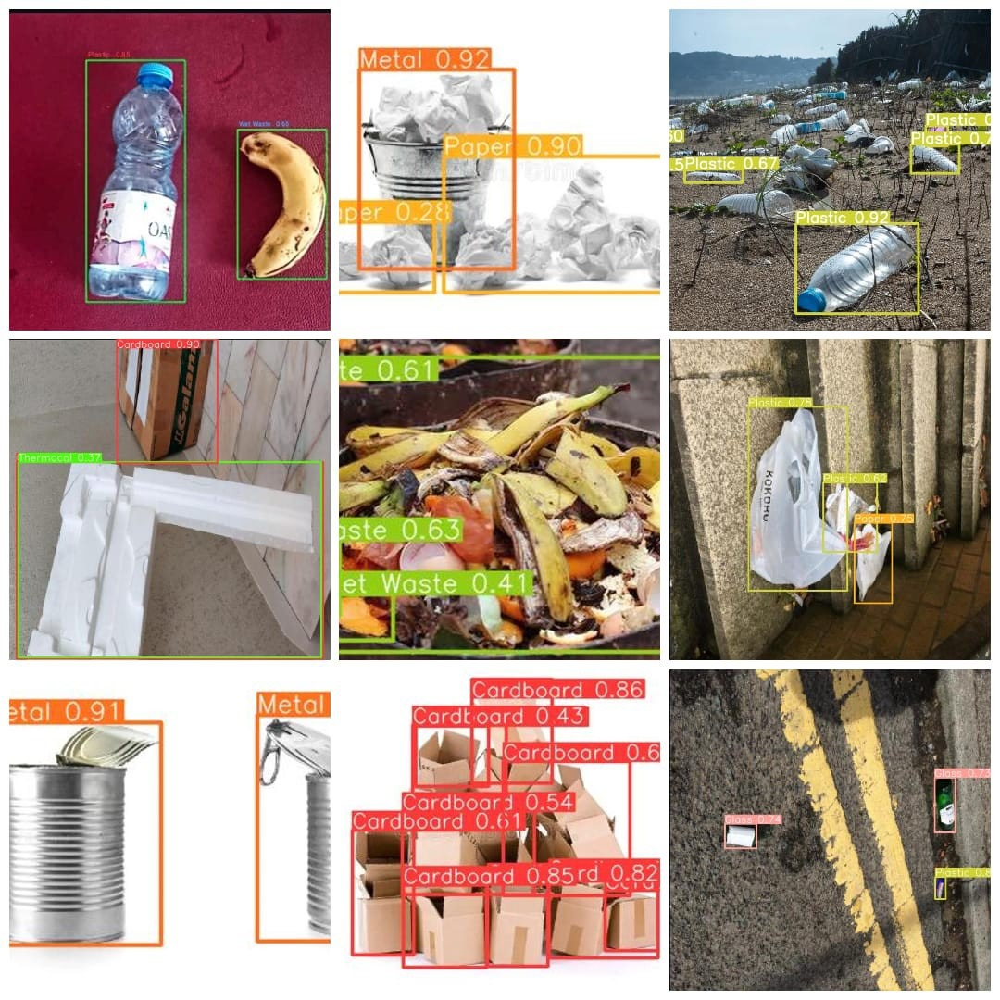
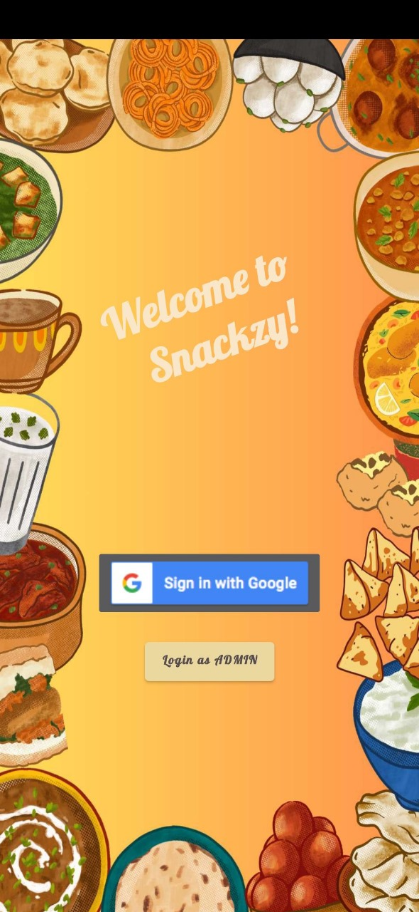
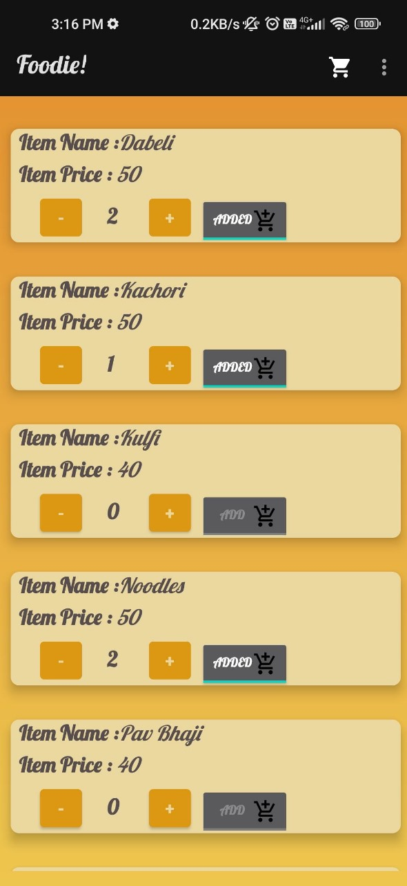
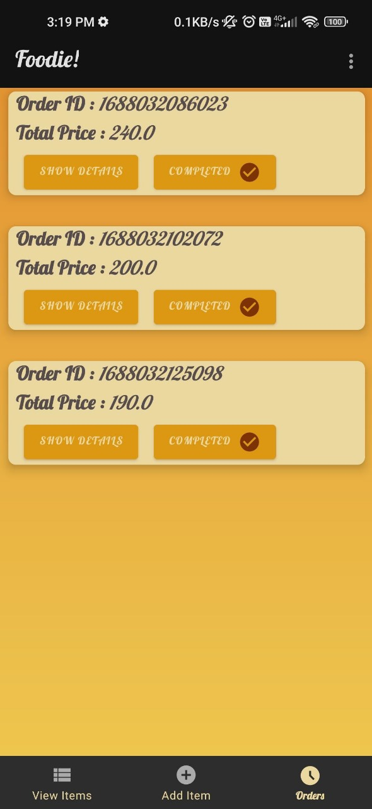
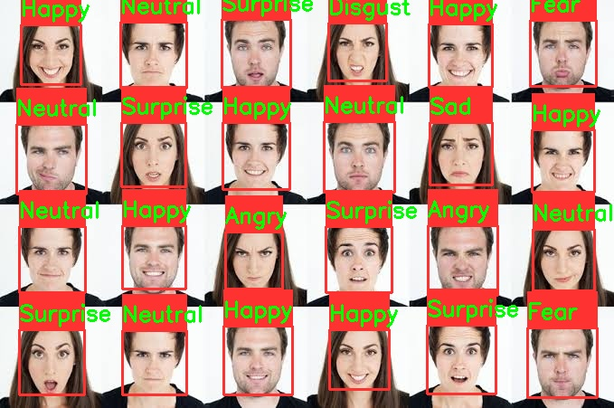
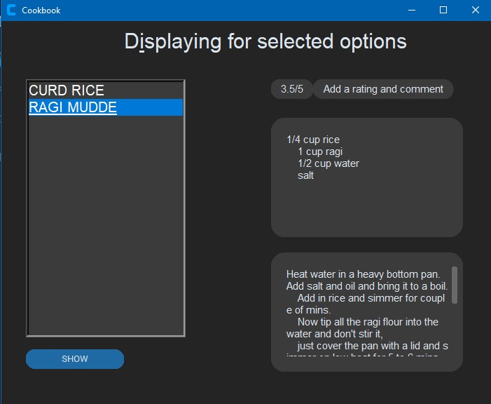
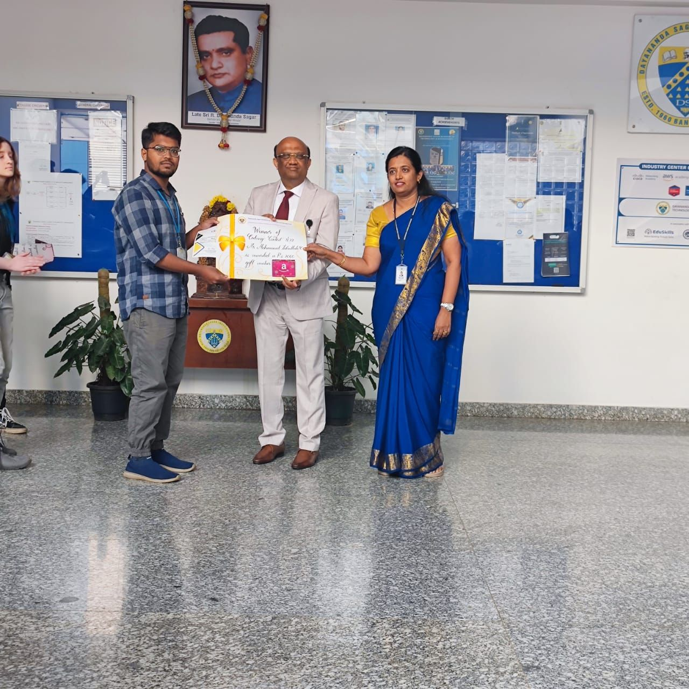
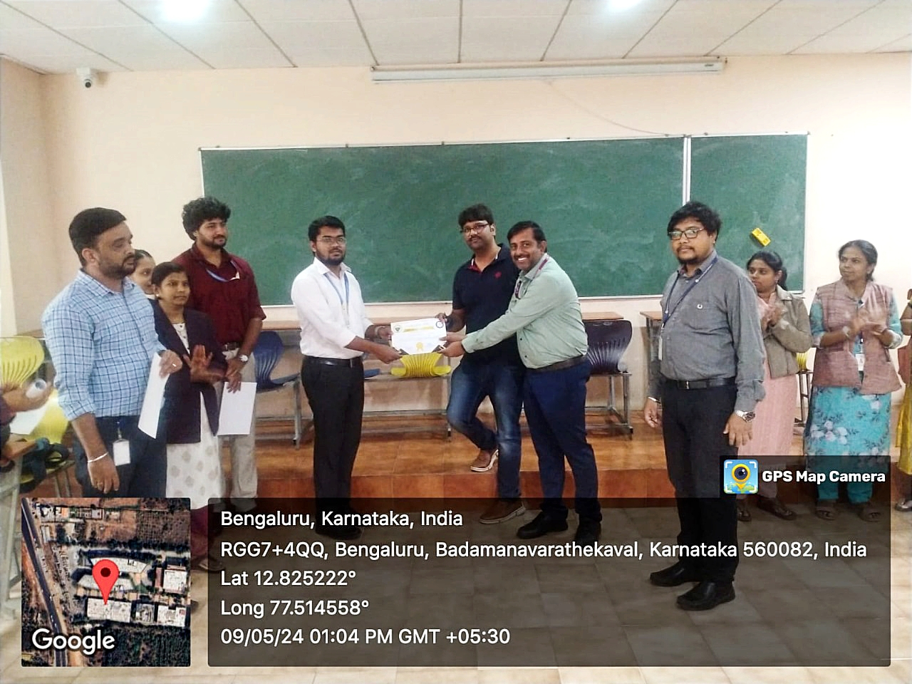
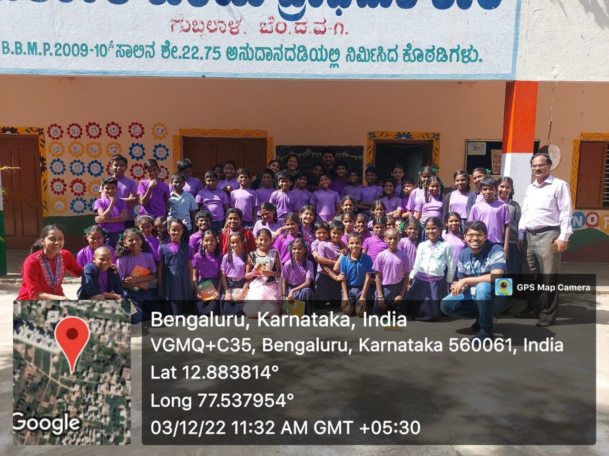

# Machine Learning Enthusiast

## Education
<table>
  <tr>
    <td>B.E</td>
    <td>Artificial Intelligence and Machine Learning</td>
    <td>Dayananda Sagar Academy of Technology and Management</td>
    <td>8.9 CGPA</td>
  </tr>
  <tr>
    <td>PUC</td>
    <td>PCMB</td>
    <td>Narayana PU College</td>
    <td>91.83%</td>
  </tr>
  <tr>
    <td>SSLC</td>
    <td>State Board</td>
    <td>Noble Saint English School</td>
    <td>76.32%</td>
  </tr>
</table>

<!-- - B.E. AIML | Dayananda Sagar Academy of Technology and Management - **8.9** CGPA								       		
- PUC (PCMB) | Narayana PU College - **91.83%**
- SSLC | Noble Saint English School - **76.32%** -->
 

## Work Experience
**Intern (_August 2023 - September 2023_) - Varcons Technologies**
- Worked with Twitter's Developer API (now X) to extract and process tweets for sentiment analysis using BERT and TF-IDF vectorizer.
- Analyzed the impact of Twitter sentiment on stock prices by training a predictive model using stock data.
- Increased the accuracy of the sentiment classifier model by 5% through fine-tuning
 

**Associate Software Engineer (_August 2024 - Present_) - Accenture**
- Undergoing comprehensive training in key business processes and Java development.
- Gaining hands-on experience in enterprise software tools, understanding workflow optimization, and applying object-oriented programming principles to real-world scenarios.
 

## Projects

### Automated Waste Segregation using Computer Vision 

- Developed an advanced waste segregation system using YOLOv5 for accurate identification and classification of various waste materials, enhancing recycling efficiency and environmental sustainability.
- This project aims to detect and classify 7 classes of waste which include paper , plastic , metal , cardboard , glass , thermocol and wet-waste. The model has been trained on datasets which are a combination of already available datasets from roboflow and images collected and manually annotated using LabelImg which consisted a total of around 7000 images. The model achieves an accuracy of 85% after 50 epochs. 

  

 

### Food Ordering App 

- Developed a canteen app utilizing Firebase Authentication and Real-time Database, enabling seamless food ordering, real-time updates, and secure payments for users
- Snackzy is a food ordering app designed for canteens. It supports real-time ordering and includes features for authentication, payment, and admin management. Admins can add or delete new items from the menu, and users can authenticate and make payments seamlessly.
<table>
  <tr>
    <td></td>
    <td></td>
    <td></td>
  </tr>
</table>
 

### Facial Emotion Detection 

- Developed a Facial Emotion Recognition system using neural networks and deep learning techniques to train the model on a comprehensive dataset to accurately identify emotions from facial expressions
- Developed a deep learning model that classifies facial emotions into seven categories: angry, disgust, fear, happy, neutral, sad, and surprise.
-  The model has been trained on the FER-2013 dataset and achieves an accuracy of 90% after 30 epochs.

  

 

### Recipe Cookbook 

- Created an application to store and display recipes, allowing users to add and filter recipes by meal type and dietary preference.
- Used MySQL as the database and Tkinter for front end.
- Recipe Cookbook is a desktop application that allows users to store, explore, and provide feedback on recipes. The application uses MySQL for database management and Tkinter for the graphical user interface.
<table>
  <tr>
    <td></td>
    <td></td>
  </tr>
</table>
 

## Technical Skills
<table>
  <tr>
    <td>Python</td>
    <td>Scikit Learn</td>
    <td>Pandas</td>
    <td>Numpy</td>
    <td>Tensorflow</td>
  </tr>
  <tr>
    <td>Torch</td>
    <td>Streamlit</td>
    <td>Firebase</td>
    <td>Git/GitHub</td>
    <td>MySQL</td>
  </tr>
  <tr>
    <td>HTML/CSS</td>
    <td>Java (Basics)</td>
    <td>C/C++ (Basics)</td>
    <td>Linux</td>
    <td>Colab</td>
  </tr>
  <tr>
    <td>Machine Learning</td>
    <td>Deep Learning</td>
    <td>Android Development</td>
    <td>Dataset Preparation</td>
    <td>Project Management</td>
  </tr>
</table>
 

## Certifications
- Python _Coursera_ 
- Java _Infoysy Springboard_ 
- Android Application Development _Great Learning_ 
- Machine Learning _Infosys Springboard_ 
- Deep Learning _Infosys Springboard_ 
- Power BI _Infosys Springboard_ 
- Workshops on IOT,AIML, Web Development, Computer Vision, Communication Skills, Decision Making conducted at Dept of AIML, DSATM 
 

## Achievements
- Won 1st place in a Coding contest conducted at the institute.

  

 

- Awarded Best Project at the Department’s Open day.

  

<!-- - Earned a Gold Badge on HackerRank for Python coding skills.  -->
 

## Extracurricular
**Volunteer (_October 2022 - March 2024_) - Way For Life**
- Volunteered with an NGO conducting research on government schools, old age homes, and orphanages, while also leading tree planting and community cleaning drives.

  

 

## Interests
Coding • AI • Chess • Drawing • Research • Nature Documentaries

## [Download Resume](https://drive.google.com/file/d/1BxXpJbvTC9IcsGRk1heGPc3nlexhTMa2/view?usp=drive_link) 

## Contact
<table>
  <tr>
    <td></td>
    <td></td>
    <td></td>
    <td></td>
  </tr>
</table>

<!-- 
| | | |
|:--|:--| :--|
|B.E|AIML| DSATM -->
